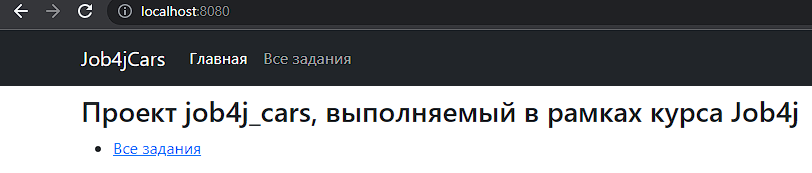
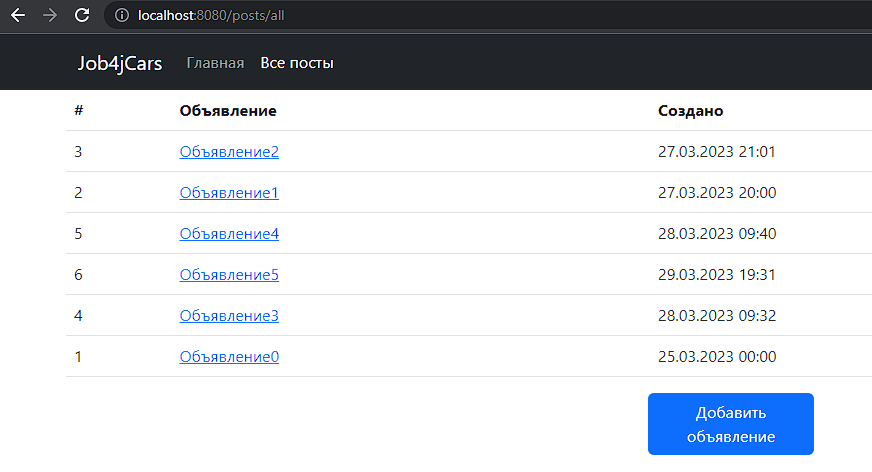
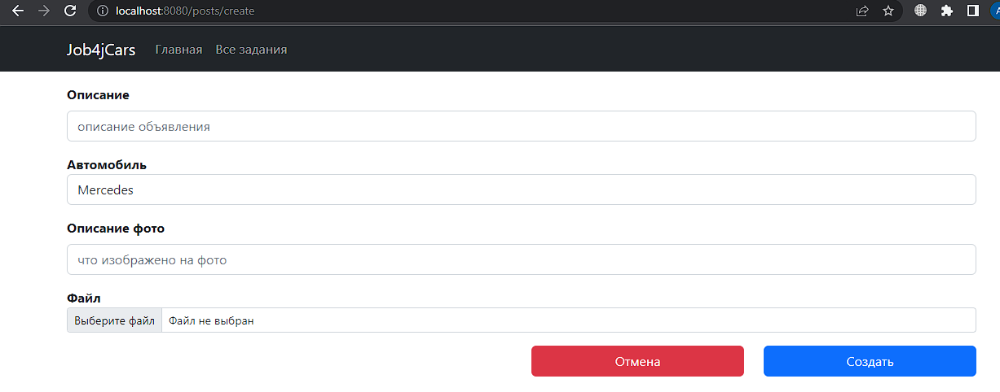
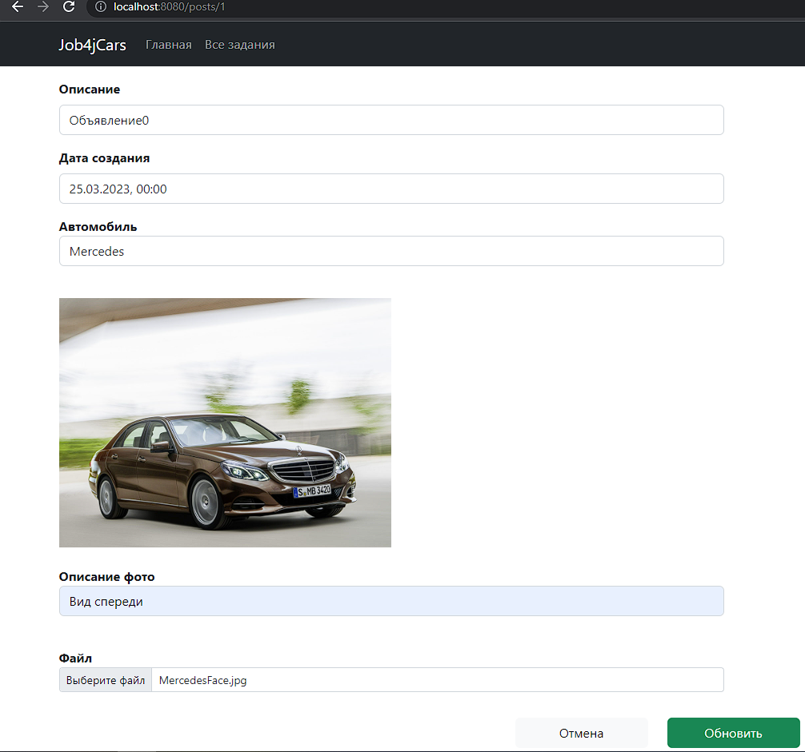
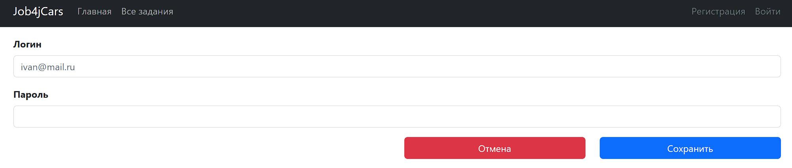
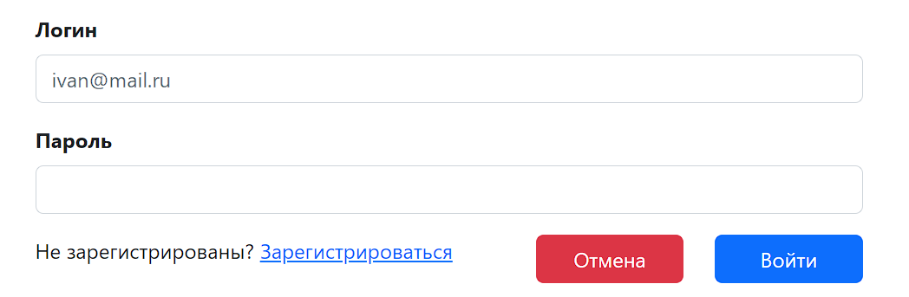

# job4j_cars
Сайт по продаже машин

# Описание
На сайте публикуются объявления о продаже автомобилей. Каждое объявление содержит марку автомобиля, тип кузова, краткое 
описание и фото. Также объявление содержит текущий статус - продается или продано.

# Стек технологий
- Java 17;
- PostgreSQL 14;
- Spring Boot 2;
- Hibernate 5;
- Lombok 1;
- Thymeleaf 3;
- Bootstrap 5;
- Liquibase 4;

# Требования к окружению
- Java 17;
- Maven 3.8;
- PostgreSQL 14.

# Запуск проекта
1. Создать БД: ```create database carshop```.
2. Запустить приложение из класса Main.
3. Запустить браузер и открыть главную страницу: ```http://localhost:8080/index```.

# Взаимодействие с приложением (в разработке)
- титульная страница:

- страница со списком объявлений:

- страница для создания объявления:

- страница для редактирования объявления:

- регистрация пользователя:

- вход пользователя:


# Контакты
mymail@gmail.com.